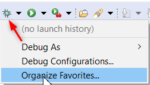
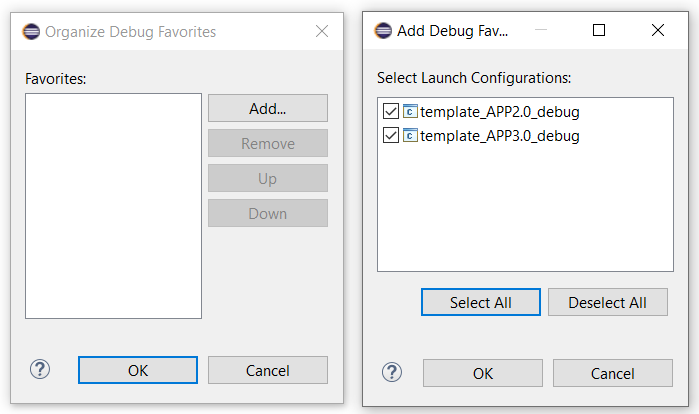
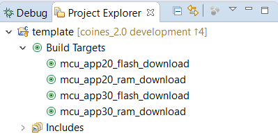
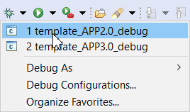

# Using the `template` project in Eclipse
- Download latest [GNU ARM Eclipse](https://github.com/gnu-mcu-eclipse/org.eclipse.epp.packages/releases)
- Download and install [JLink](https://www.segger.com/downloads/jlink/#J-LinkSoftwareAndDocumentationPack) and add to PATH
- Import the template project
  
- Click Debug icon --> Organize favorites

- Click **Add** and **Select All** Launch configurations

•	In project explorer, click any of the **Build Targets**

 
•	After successful download, click any of the **Debug configurations**

